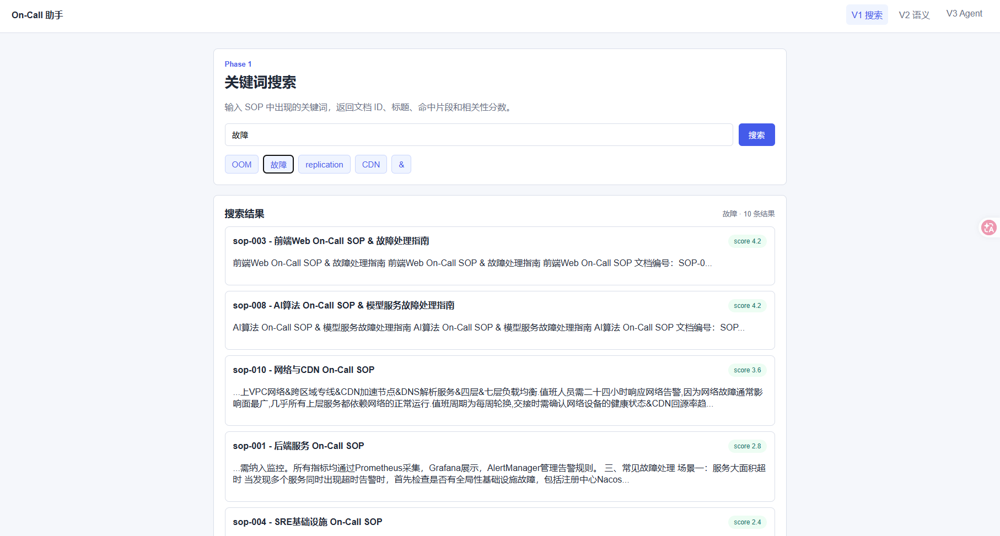
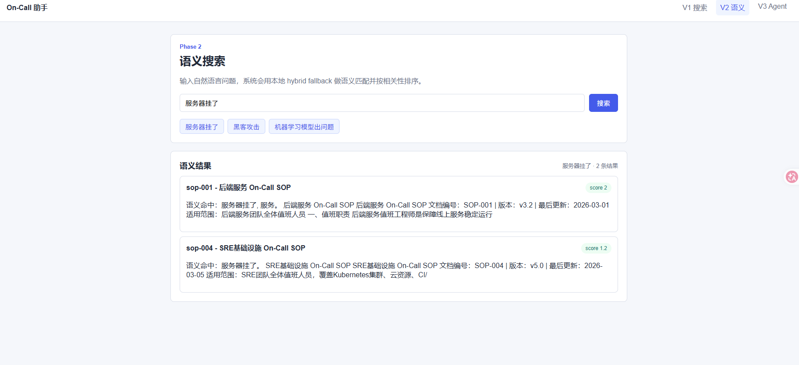
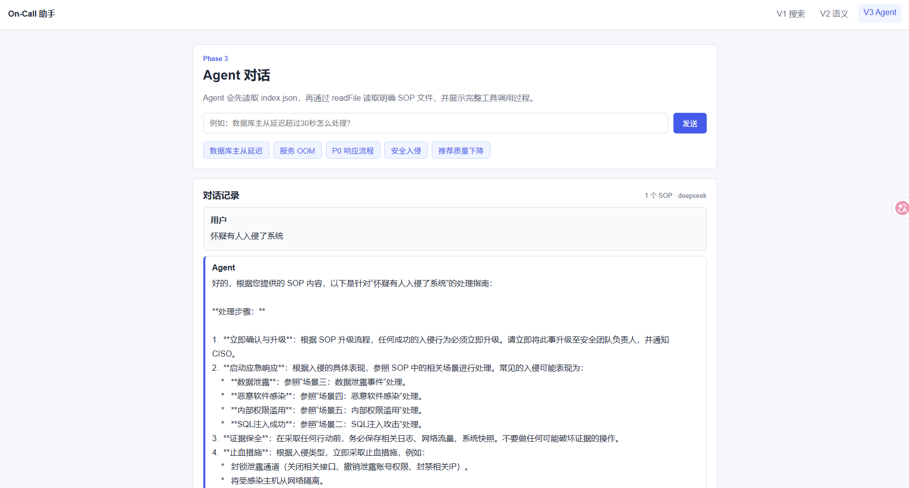

# On-Call Assistant

> 🚀 一个面向值班工程师的 SOP 检索与智能问答系统。  
> 从告警关键词到故障处置建议，帮助 On-Call 人员更快定位 SOP、确认排查步骤、升级路径和禁止操作。


## ✨ 项目亮点

- 🔎 **关键词搜索**：支持 `OOM`、`CDN`、`故障`、`&` 等查询，自动返回 SOP 片段和相关性分数。
- 🧠 **语义搜索**：用户可以输入“服务器挂了”“黑客攻击”“机器学习模型出问题”这类自然语言。
- 🤖 **Agent 问答**：通过对话回答 On-Call 问题，并展示完整 `readFile` 工具调用过程。
- 🛡️ **工具安全约束**：Agent 只能读取 `data/` 目录下的明确文件名，拒绝路径穿越和通配符。
- 🧪 **一键验收**：提供 `pytest`、接口验证脚本和一键验收脚本。
- 🔌 **DeepSeek 可选接入**：开发默认本地 Agent，上线前可切换 DeepSeek API。

## 🧭 三阶段能力

| 阶段 | 页面 | 核心能力 | 验收重点 |
| --- | --- | --- | --- |
| Phase 1 | `/v1` | 关键词搜索 | `OOM`、`故障`、`replication`、`CDN`、`&` |
| Phase 2 | `/v2` | 语义搜索 | `服务器挂了`、`黑客攻击`、`机器学习模型出问题` |
| Phase 3 | `/v3` | Agent 对话 | SOP 定位、`readFile` 工具调用、P0 多文档综合 |

## 🖼️ 页面预览

### 🔎 Phase 1：关键词搜索



### 🧠 Phase 2：语义搜索



### 🤖 Phase 3：Agent 对话



## 🧱 技术栈

| 模块 | 技术 | 说明 |
| --- | --- | --- |
| 后端 API | FastAPI | 三阶段接口和页面路由 |
| 运行服务 | Uvicorn | ASGI 服务 |
| HTML 清洗 | BeautifulSoup4 | 提取标题和正文，排除 `script/style/noscript` |
| 前端页面 | Jinja2 + 原生 JS/CSS | 无复杂构建流程，适合面试演示 |
| 搜索 | 关键词匹配 + 本地 hybrid fallback | 稳定满足题目验收 |
| Agent | 本地 Agent / DeepSeek API | `AGENT_MODE` 控制运行模式 |
| 验证 | pytest + verify.py | 单元测试和接口验收 |

## 🚀 快速启动

```powershell
cd C:\Users\he\Desktop\aicoding\oncall\code
uv venv
uv sync
.\scripts\run_dev.ps1
```

浏览器访问：

```text
http://127.0.0.1:8000/v1
http://127.0.0.1:8000/v2
http://127.0.0.1:8000/v3
http://127.0.0.1:8000/docs
```

## ✅ 一键验收

```powershell
cd C:\Users\he\Desktop\aicoding\oncall\code
.\scripts\verify_all.ps1
```

当前验收结果：

```text
21 passed
All verification checks passed.
```

## 🔌 DeepSeek 配置

默认使用本地 Agent，不消耗 API：

```text
AGENT_MODE=local
```

如需上线前验证 DeepSeek：

```powershell
cd C:\Users\he\Desktop\aicoding\oncall\code
Copy-Item .env.example .env
```

在 `.env` 中填写：

```text
AGENT_MODE=deepseek
DEEPSEEK_API_KEY=your_deepseek_api_key
DEEPSEEK_BASE_URL=https://api.deepseek.com
DEEPSEEK_MODEL=deepseek-v4-pro
DEEPSEEK_PROXY=http://127.0.0.1:7897
```

安全说明：

- 🔐 `.env` 已被 `.gitignore` 忽略，不会提交 API Key。
- 🛠️ DeepSeek 不能直接访问文件系统，只能由后端受控调用 `readFile(fname)`。
- 🚧 DeepSeek 不可用时会回退本地 Agent，保证演示不中断。

## 🧪 核心验收样例

### Phase 1

| 查询 | 期望 |
| --- | --- |
| `OOM` | 返回 `sop-001` |
| `故障` | 返回多个 SOP |
| `replication` | 返回空 |
| `CDN` | 返回 `sop-003`、`sop-010` |
| `&` | 正确处理特殊字符 |

### Phase 2

| 查询 | 期望 |
| --- | --- |
| `服务器挂了` | `sop-001`、`sop-004` 靠前 |
| `黑客攻击` | `sop-005` 靠前 |
| `机器学习模型出问题` | `sop-008` 靠前 |

### Phase 3

| 用户问题 | 期望工具调用 |
| --- | --- |
| `数据库主从延迟超过30秒怎么处理？` | `index.json`、`sop-002.html` |
| `服务 OOM 了怎么办？` | `index.json`、`sop-001.html` |
| `P0 故障的响应流程是什么？` | `index.json` + 多个 SOP |
| `怀疑有人入侵了系统` | `index.json`、`sop-005.html` |
| `推荐结果质量下降了` | `index.json`、`sop-008.html` |

## 🗂️ 目录结构

```text
oncall/
  README.md                         # GitHub 展示文档
  需求分析计划.md
  On-Call助手项目实施方案.md
  code/
    README.md                       # 详细开发说明
    app/
    data/
    scripts/
    tests/
  screenshot/
    front/
      v1.png
      v2.png
      v3.png
  prompt/
```

## 📌 更多说明

详细开发说明、API 示例、评分点对照表、错误处理与安全验证请查看：

```text
code/README.md
```
